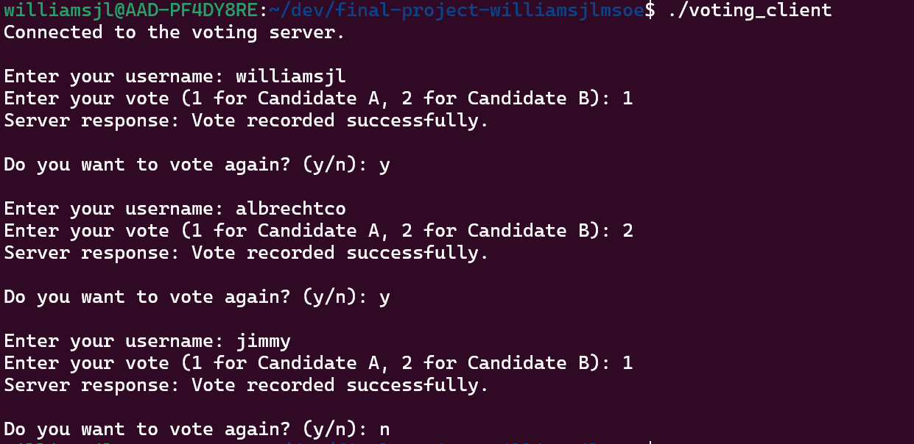
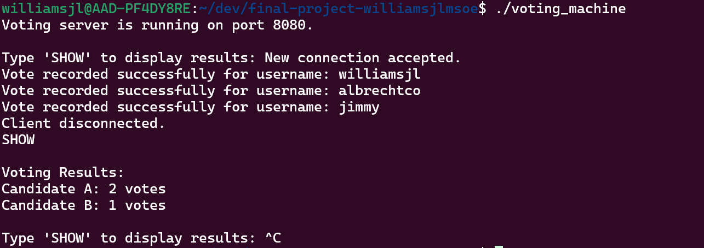

# Voting System

A simple client-server voting application implemented in C.

## Components
- **Voting Client (`voting_client.c`)**: Enables users to cast votes.
- **Voting Machine (`voting_machine.c`)**: A multithreaded server that tracks and displays voting results.

## Setup
1. Compile the programs:
   - Client: `gcc -o voting_client voting_client.c`
   - Server: `gcc -o voting_machine voting_machine.c -pthread`
2. Start the server: `./voting_machine`
3. Run the client in another terminal: `./voting_client`

## Usage
- **Client**: Enter a username and vote (1 for Candidate A, 2 for Candidate B). Optionally vote again or exit.
- **Server**: View real-time results by typing `SHOW`.

## Output
- **Client**: 
- **Server**: 

## Authors
Connor Albrecht and John Williams
